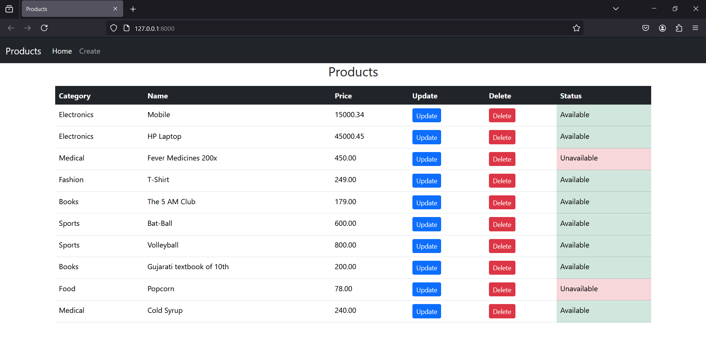
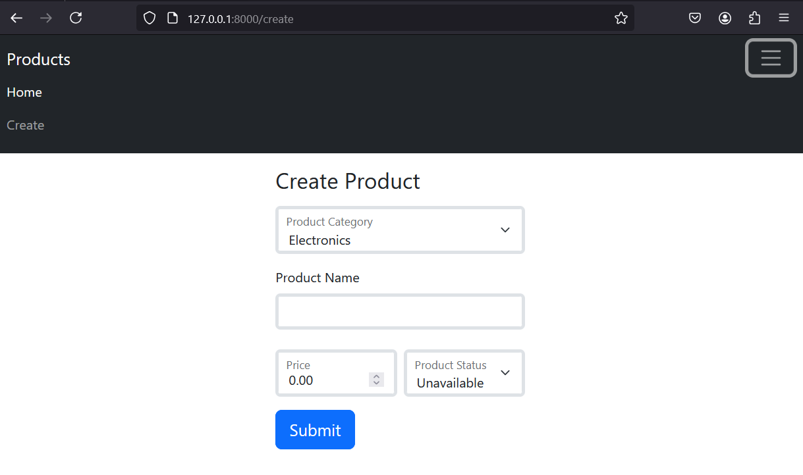
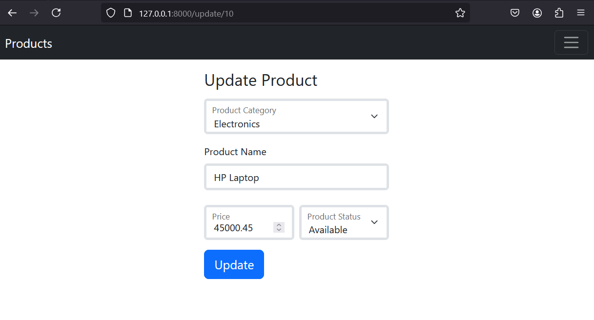

# Django CRUD Operations with test suits 

## Run this Project on your Local machine 

### Clone This Repo 
```commandline
git clone https://github.com/Sandip-Kanzariya/Django-CRUD.git
```

### Create Virtual Environment (py = python)

```bash
python -m venv .venv
```

### Activate Virtual Environment

```bash
.venv\Scripts\activate
```

### Install Packages From requirements.txt

```bash
pip install -r requirements.txt
```

### Run Django Project
```commandline
python manage.py runserver 
```

### Run Test Suite
```commandline
python manage.py test
```

# Steps to Create Django Project from Scratch 

### Create and Install
```commandline
django-admin startproject crud .

python manage.py startapp home
```

### Migrations 
```commandline
python manage.py makemigrations 
python manage.py migrate 
```

### Create Superuser (If you want)
```commandline
python manage.py createsuperuser
```

### Run Django Project
```commandline
python manage.py runserver 
```

### Run Test Suite
```commandline
python manage.py test
```

> Home Page 

> Create Page 

> Update Page 
